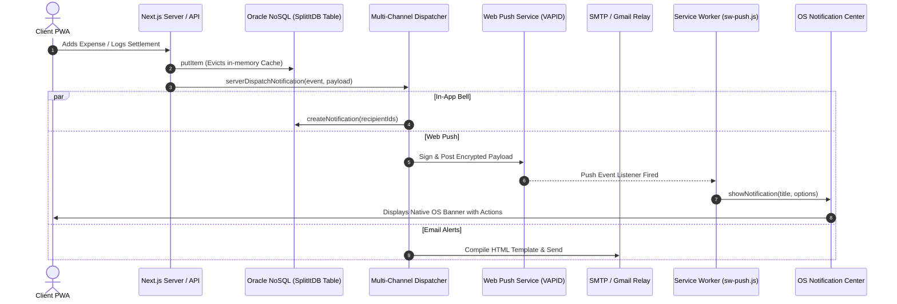
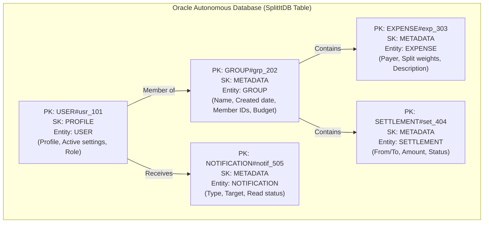

<div align="center">

# 💸 SplitIt — Premium Full-Stack Expense Splitting & Budgeting Engine

SplitIt is a state-of-the-art, high-density bill-splitting and financial analytics application designed to eliminate friction from shared finances for trips, roommates, teams, and projects.

Built on **Next.js 15 (App Router)**, **Oracle Autonomous Cloud Database**, **Better Auth**, and **Tailwind CSS**, it features real-time category budgeting, safe burn-rate projections, native OS push notifications, granular delivery matrix controls, and debt simplification algorithms.

[](https://nextjs.org/)
[](https://www.oracle.com/)
[](https://tailwindcss.com/)
[](https://www.better-auth.com/)

> 🌐 Check out the [live production version](https://split.cvweb.tech) for the latest features.

</div>

---

## 🗺️ Architectural Overview

### System Data Flows & Infrastructure
SplitIt runs on Next.js Server Components and API routes that connect to an Oracle Autonomous Cloud Database via high-performance connection pooling with automatic keep-alive (`SQLNET.EXPIRE_TIME=1`) and transient auto-retry handling. Below is a map demonstrating the flow from user action to background multi-channel notification dispatch:



---

## 🎨 Core Features In-Depth

### 💸 Financial Engines & Splitting Schemes
- **Multiple Splitting Algorithms**:
  - **Equally**: Costs split evenly with penny-rounding compensation (allocating remainder cents to the primary payer so sums match exactly).
  - **Unequally**: Specify precise local currency amounts owed per participant.
  - **By Shares**: Split proportionally by custom weights/shares.
  - **By Percentage**: Allocate costs based on percentage targets (e.g. 60/40 splits).
- **Multiple Payers**: Supports multiple members contributing different amounts to a single expense.
- **Smart Debt Simplification**: Solves a flow reduction problem to minimize individual transactions. It aggregates all group balances and resolves them in the minimum possible number of individual transfers.
- **Dynamic Multi-Currency support**: Native support for dynamic currency symbols (₹, $, €, £, ¥, etc.) per group.

### 📊 Advanced Group Budgeting & Safe Daily Burn Analytics
- **Master Group Limits & Optional Category Caps**: Set overall monthly spending goals with optional sub-limits across 12 master categories (Food, Travel, Utilities, Housing, Entertainment, etc.).
- **Segmented Distribution Meter**: Real-time visual comparison bar displaying proportional allocations vs the remaining flexible unassigned group pool.
- **Live Auto-Summing & Limit Safeguards**: Auto-calculates total budgets from category inputs and prevents category caps from exceeding the monthly budget.
- **Predictive Burn Rate & Exhaustion Forecaster**:
  - **Safe Daily Burn Limit**: Computes maximum safe spending per remaining calendar day to stay on budget.
  - **Predicted Exhaustion Day**: Calculates the exact calendar day when funds will deplete based on current daily burn pacing.
- **Automated Threshold Benchmarks**: Generates warnings and triggers notifications at **75% Caution**, **90% Warning**, and **100% Exceeded** thresholds.

### 📱 Multi-Channel Notification Center
- **Web Push (VAPID)**: Background push notifications mapped to category-specific visual icons and deep-link actions.
- **Granular Delivery Matrix (`/notifications/settings`)**: Users can independently toggle In-App notifications, OS Push alerts, and Emails per event type across 16+ specific events.
- **In-App Notification Feed**: Popover notification bell containing unread badges, filter tabs, read states, and quick actions.

### 🛠️ High-Density Admin Panel
- **Branding Panel**: Customize application name, icons, and legal documents in real-time.
- **Dynamic Theming Editor**: Manage CSS theme custom variables that render globally for users.
- **SMTP Mail Configuration**: Direct mail relays or Gmail OAuth setups to compile test mails and dispatch automated transactional alerts.
- **Broadcast System**: Dispatch bulk messages or critical system alerts via email or in-app popovers.
- **Ticketing Console**: View and reply to user-submitted help and support issues.

---

## 🗄️ Database Architecture & Key-Document Model

SplitIt stores all documents in a single table `SplitItDB` in the **Oracle Autonomous Database** using a key-document schema. Relational lookups are mapped through Partition Keys (`PK`), Sort Keys (`SK`), and Global Secondary Indexes (`GSI1_PK`/`GSI1_SK`).



### Table Mappings Matrix

| Entity Type | PK Format | SK Format | GSI1_PK | GSI1_SK | Payload Attributes (`DATA` JSON) |
| :--- | :--- | :--- | :--- | :--- | :--- |
| **USER** | `USER#<userId>` | `PROFILE` | `USER_EMAIL#<email>` | N/A | `firstName`, `lastName`, `email`, `role`, `upiId`, `avatarUrl` |
| **GROUP** | `GROUP#<groupId>` | `METADATA` | N/A | N/A | `name`, `members` `[ {userId, role} ]`, `budget`, `archived` |
| **EXPENSE** | `EXPENSE#<expenseId>` | `METADATA` | `GROUP#<groupId>` | `EXPENSE#<expenseId>` | `amount`, `payerId`, `splitType`, `participants`, `category`, `date` |
| **SETTLEMENT** | `SETTLEMENT#<id>` | `METADATA` | `GROUP#<groupId>` | `SETTLEMENT#<id>` | `amount`, `fromUserId`, `toUserId`, `date`, `notes` |
| **NOTIFICATION** | `NOTIFICATION#<id>` | `METADATA` | `USER#<actorId>` | `NOTIFICATION#<id>` | `type`, `title`, `body`, `recipientIds`, `reads`, `createdAt` |
| **PREFERENCES** | `USER#<userId>` | `NOTIFICATION_PREFS` | N/A | N/A | `inAppEnabled`, `pushEnabled`, `emailEnabled`, `events` |

### Database Read Cache & Connection Resilience
- **15s In-Memory Cache**: Transparent caching layer (`readCache`) in `src/lib/nosql.ts` caches frequent reads. Write actions (`putItem` and `deleteItem`) automatically evict corresponding cache keys.
- **Oracle Connection Keep-Alive**: `SQLNET.EXPIRE_TIME=1` sends periodic TCP keep-alive probes to prevent cloud firewall idle disconnects.
- **Pool Validation & Auto-Reconnect**: `node-oracledb` pool uses `poolPingInterval: 60` and `poolMin: 0` to evict dead sockets and automatically re-executes recoverable queries.

---

## ⚡ Key Optimizations & Security Layers

1. **Better Auth Adapter & Session Hydration**:
   The custom adapter `nosqlAuthAdapter` hydrates sessions, handles credential and Google OAuth profiles, links accounts automatically, and stores tokens securely in Oracle DB.
2. **Dynamic UPI Bridges**:
   Implements an HTTP redirect route `/api/pay-upi` resolving standard `upi://` schemes, enabling tap-to-pay deep links to work in modern email clients.
3. **No Loopback HTTP Calls**:
   Server-side modules invoke the notification dispatcher via local dynamic imports, bypassing network overhead and eliminating self-referential HTTP failures.
4. **CSS Double-Blink Choreography**:
   Combines `useWatch` inputs and dynamic query caches to scroll, expand, and visually highlight target deep-linked items upon navigating from notifications.
5. **Direct VAPID Web Push**:
   Pure standards-compliant Web Push implementation without external third-party SDK dependencies.

---

## ⚙️ Environment Configuration

Copy the provided `.env.example` template to `.env.local` and configure your credentials:

```bash
cp .env.example .env.local
```

### Essential Environment Variables:

```env
# ─── APPLICATION BASE ────────────────────────────────────────────────────────
NODE_ENV=development
NEXT_PUBLIC_APP_URL="http://localhost:3231"
BETTER_AUTH_URL="http://localhost:3231"

# ─── DATABASE (ORACLE AUTONOMOUS CLOUD) ──────────────────────────────────────
ORA_WALLET_DIR="./wallet"
ORA_DB_USER="ADMIN"
ORA_DB_PASSWORD="your_oracle_db_password"
ORA_CONNECT_STRING="splititdb_high"

# ─── AUTHENTICATION (BETTER AUTH & GOOGLE OAUTH) ──────────────────────────────
BETTER_AUTH_SECRET="your_32_char_better_auth_secret"
GOOGLE_CLIENT_ID="your_google_client_id.apps.googleusercontent.com"
GOOGLE_CLIENT_SECRET="your_google_client_secret"
ADMIN_EMAIL="admin@yourdomain.com"

# ─── PUSH NOTIFICATIONS (VAPID WEB PUSH) ─────────────────────────────────────
NEXT_PUBLIC_VAPID_PUBLIC_KEY="your_vapid_public_key"
VAPID_PRIVATE_KEY="your_vapid_private_key"
VAPID_EMAIL="mailto:admin@yourdomain.com"

# ─── OBJECT STORAGE (OCI S3-COMPATIBLE) ──────────────────────────────────────
OCI_REGION="ap-mumbai-1"
OCI_NAMESPACE="your_tenancy_namespace"
OCI_STORAGE_BUCKET="splitit-storage"
OCI_STORAGE_ENDPOINT="https://your_namespace.compat.objectstorage.ap-mumbai-1.oraclecloud.com"
OCI_S3_ACCESS_KEY="your_s3_access_key"
OCI_S3_SECRET_KEY="your_s3_secret_key"

# ─── BACKGROUND CRON SECURITY ────────────────────────────────────────────────
INTERNAL_API_SECRET="your_shared_background_cron_key_secret"
```

---

## 🚀 Local Installation & Quick Start

1. **Clone & Install Dependencies**:
   ```bash
   git clone https://github.com/Yashraj-Jangra/SplitIt-SplitWise_Clone.git
   cd SplitWise-Clone
   npm install
   ```

2. **Configure Environment & Oracle Wallet**:
   - Copy `.env.example` to `.env.local` and populate your secrets.
   - Place your Oracle Database mTLS connection wallet files into `./wallet/` (e.g. `cwallet.sso`, `tnsnames.ora`, `sqlnet.ora`).

3. **Start Development Server**:
   ```bash
   npm run dev
   ```
   Open [http://localhost:3231](http://localhost:3231) in your browser.

4. **Verify TypeScript Compilation**:
   ```bash
   npx tsc --noEmit
   ```

---

## 📄 License
This project is licensed under the MIT License — see the [LICENSE](LICENSE) file for details.