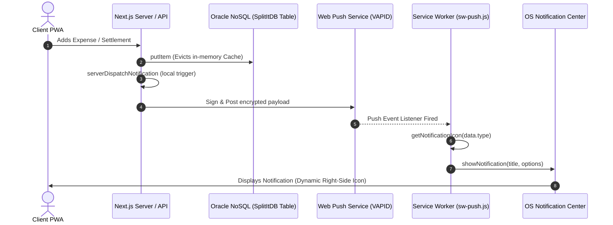
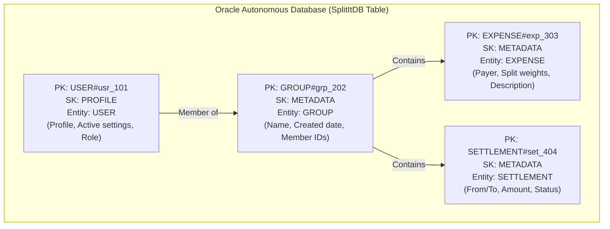
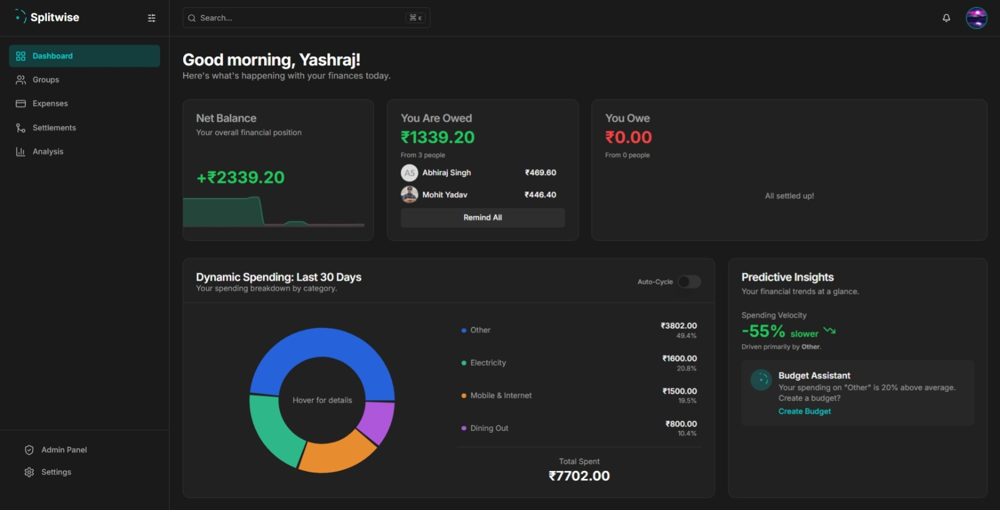
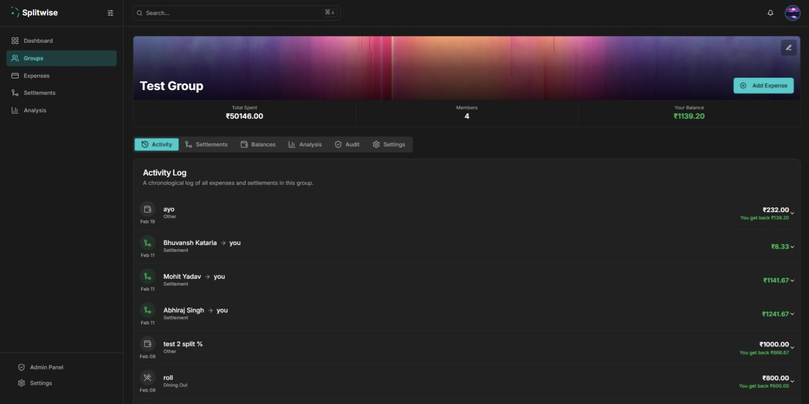
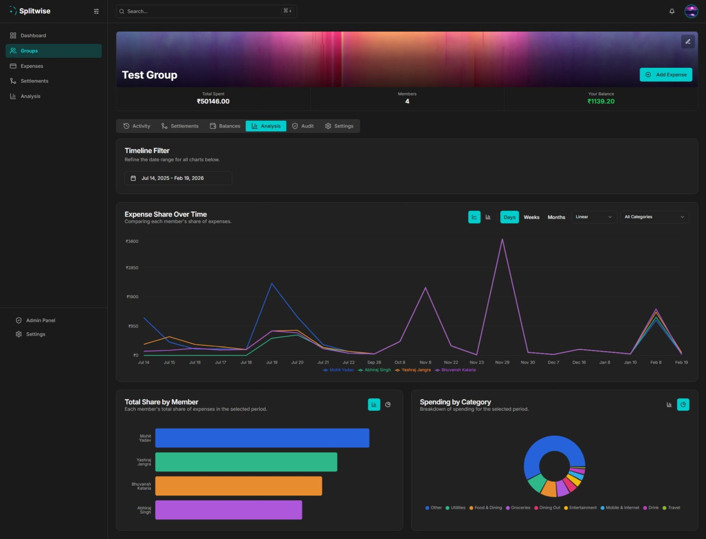
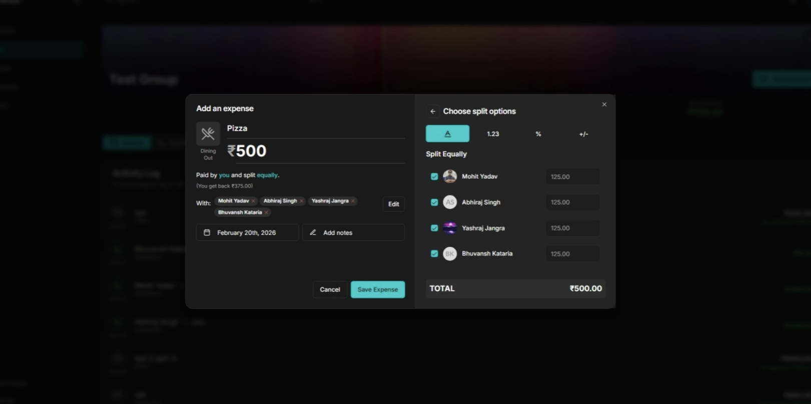
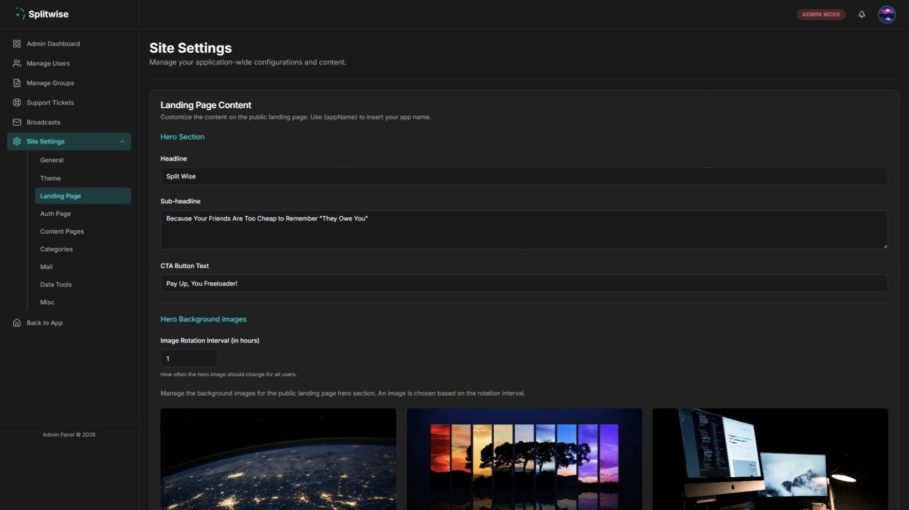
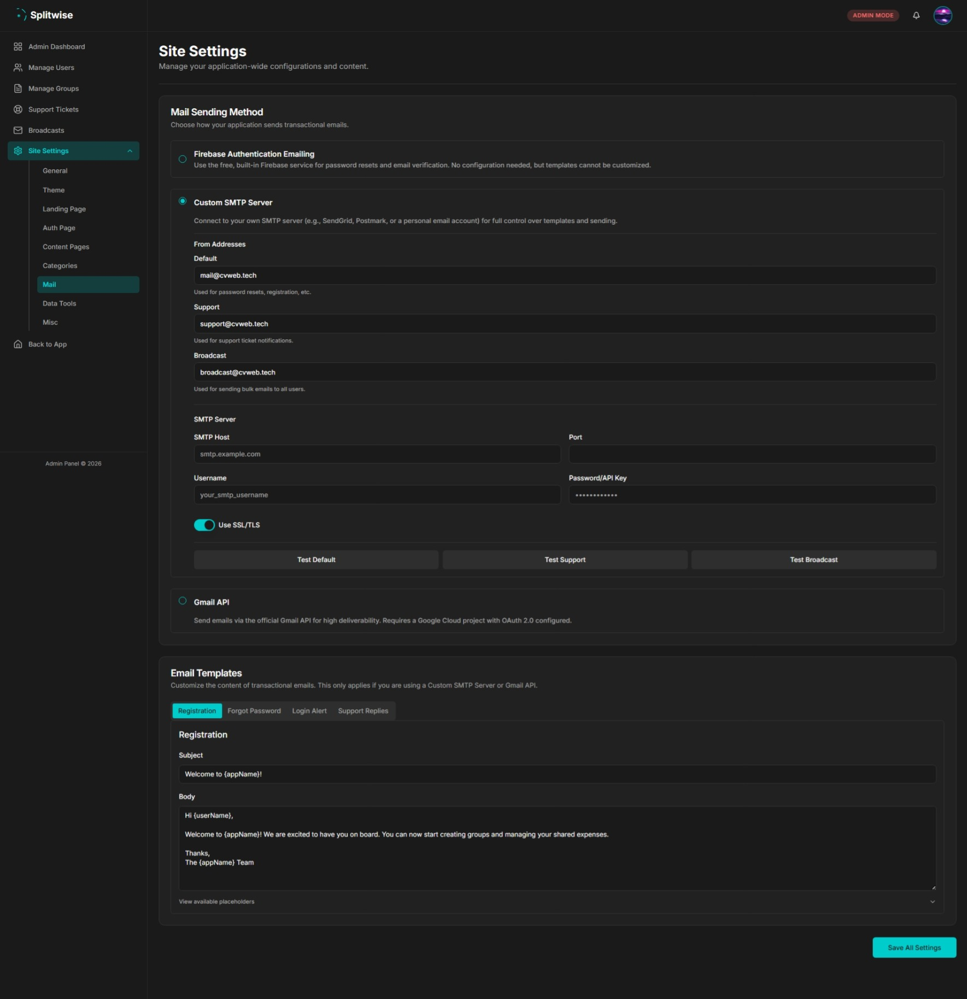
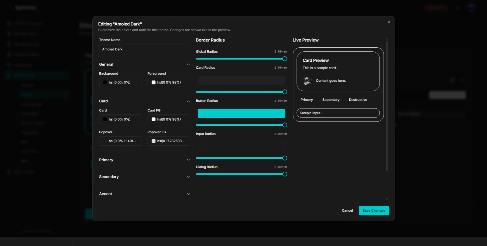
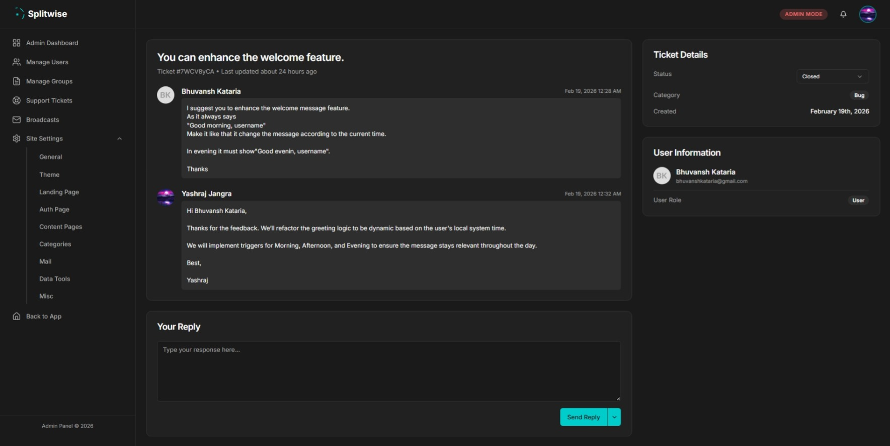

<div align="center">

# 💸 SplitIt — Premium Full-Stack Expense Splitting Engine

SplitIt is a state-of-the-art, high-density bill-splitting application designed to remove the complexity from shared finances for trips, vacations, roommates, and projects. 

Built on the **Next.js App Router**, **Oracle Autonomous Database**, **Better Auth**, and **Tailwind CSS**, it features native OS push notifications, granular settings, spending dashboards, and transactional templates.

[](https://nextjs.org/)
[](https://www.oracle.com/)
[](https://tailwindcss.com/)
[](https://www.better-auth.com/)

> 🌐 Check out the [live production version](https://split.cvweb.tech) for the latest features.

</div>

---

## 🗺️ Architectural Overview

### System Data Flows & Infrastructure
SplitIt runs on Next.js Server Components and API endpoints that connect to an Oracle Autonomous Database via Node.js Thin Driver connections. Below is a map demonstrating the flow from user action to background push notification dispatch:



---

## 🎨 Core Features In-Depth

### 💸 Financial Engines & Splitting Splits
- **Multiple Splitting Schemes**:
  - **Equally**: Costs split evenly. Features a penny-rounding algorithm (allocating the remaining remainder to the primary payer so totals match exactly).
  - **Unequally**: Specify precise local currency amounts owed per participant.
  - **By Shares**: Split proportionally by custom weights/shares.
  - **By Percentage**: Allocate costs based on percentage targets (e.g. 60/40 splits).
- **Multiple Payers**: Supports multiple members contributing different amounts to a single expense.
- **Smart Debt Simplification**: Solves a flow reduction problem to minimize individual transactions. It aggregates all group balances and resolves them in the minimum possible number of individual transfers.
- **Dynamic Multi-Currency support**: Supports dynamic local currency formats (₹, $, €, £, ¥, etc.) across different groups.

### 📱 Notification Preference Settings & Channels
- **Web Push (VAPID)**: Background push notifications mapped to category-specific visual icons.
- **Granular Toggle Matrix**: Users can enable/disable In-App notifications, OS Push notifications, and Emails separately for each event type (expenses, settlements, reminders, broadcasts, support replies).
- **In-App Notification Feed**: Popover bell containing unread counts, settings, and filter tabs (All, Groups, Payments, System, Reminders).

### 🛠️ High-Density Admin Panel
- **Branding Panel**: Customize the application name, icons, and legal documents.
- **Dynamic Theming Editor**: Manage CSS theme custom variables that render globally for users.
- **SMTP Mail Configuration**: Direct mail relays or Gmail OAuth setups to compile test mails and dispatch automated transactional alerts.
- **Broadcast System**: Dispatch bulk messages or critical system alerts via email or in-app popovers.
- **Ticketing Console**: View and reply to user-submitted help and support issues.

---

## 🗄️ Database Architecture & Key-Document Model

SplitIt stores all documents in a single table `SplitItDB` in the **Oracle Autonomous Database** using a key-document schema. Relational lookups are mapped through Partition Keys (`PK`), Sort Keys (`SK`), and Global Secondary Indexes (`GSI1_PK`/`GSI1_SK`).



### Table Mappings Matrix

| Entity Type | PK Format | SK Format | GSI1_PK | GSI1_SK | Payload Attributes (`DATA` JSON) |
| :--- | :--- | :--- | :--- | :--- | :--- |
| **USER** | `USER#<userId>` | `PROFILE` | `USER_EMAIL#<email>` | N/A | `firstName`, `lastName`, `email`, `role`, `upiId` |
| **GROUP** | `GROUP#<groupId>` | `METADATA` | N/A | N/A | `name`, `members` `[ {userId, role} ]`, `archived` |
| **EXPENSE** | `EXPENSE#<expenseId>` | `METADATA` | `GROUP#<groupId>` | `EXPENSE#<expenseId>` | `amount`, `payerId`, `splitType`, `participants`, `date` |
| **SETTLEMENT** | `SETTLEMENT#<id>` | `METADATA` | `GROUP#<groupId>` | `SETTLEMENT#<id>` | `amount`, `fromUserId`, `toUserId`, `date`, `notes` |
| **PREFERENCES** | `USER#<userId>` | `PREFS` | N/A | N/A | `emailEnabled`, `pushEnabled`, `events { type: { push, email } }` |

### Database Read Cache (15s TTL)
To maximize throughput and bypass network latency:
- A transparent caching layer (`readCache`) is implemented in `src/lib/nosql.ts`.
- It caches successful `getItem` and GSI query responses.
- Write actions (`putItem` and `deleteItem`) automatically evict corresponding cache keys to maintain 100% data consistency.

---

## 🖼️ Application Interfaces & Screenshots

Below are the screenshots of SplitIt's dashboards and management consoles:

### 📱 Client Application
<div align="center">


*App Dashboard — net balance dashboard, quick stats, obligations card.*


*Group Details — real-time group activity feed, members, and transactions.*


*Group Spendings — category distributions and trends over time.*


*Expense Builder — equal splits, shares, and custom percentages split selectors.*

</div>

### 🛠️ Admin Management Panel
<div align="center">


*Site Customizations — branding, logos, legal page content configurations.*


*SMTP Mailer — mail relay parameters, dynamic port setup, and connection verifications.*


*Dynamic Themes — setup, customize, and deploy CSS var-based themes.*


*Ticketing Console — manage user support requests and ticket feeds.*

</div>

---

## ⚡ Key Optimizations & Security Layers

1. **Better Auth Adapter & Session Fixes**:
   The custom adapter `nosqlAuthAdapter` hydrates sessions, handles credential and Google OAuth profiles, links accounts automatically, and stores tokens in the Oracle DB.
2. **Dynamic UPI Bridges**:
   Implements an HTTP redirect route `/api/pay-upi` resolving standard `upi://` schemes, enabling tap-to-pay deep links to work in modern email clients.
3. **No Loopback HTTP Calls**:
   Server-side modules invoke the notification service via local Dynamic Imports, bypassing HTTP overhead and preventing connection errors.
4. **CSS Double-Blink Choreography**:
   Combines `useWatch` inputs and dynamic query caches to scroll, expand, and visually highlight target deep-linked items upon navigating from notifications.
5. **No Firebase Messaging Overhead**:
   Entirely clean of external notification modules. Web push is delivered directly via standard VAPID servers.

---

## ⚙️ Environment Configuration

Configure the following variables in your local `.env.local` file:

```env
# ─── APPLICATION SETTINGS ──────────────────────────────────────────────────
NODE_ENV=development
NEXT_PUBLIC_APP_URL=http://localhost:3231
BETTER_AUTH_URL=http://localhost:3231

# ─── DATABASE CONFIGURATION (ORACLE AUTONOMOUS) ─────────────────────────────
# ORA_WALLET_DIR points to the folder containing your Oracle Instant Client wallet
ORA_WALLET_DIR=./wallet
ORA_DB_USER=ADMIN
ORA_DB_PASSWORD=your_db_password_here
ORA_CONNECT_STRING=your_db_service_name_high

# ─── AUTHENTICATION (BETTER AUTH) ───────────────────────────────────────────
BETTER_AUTH_SECRET=your_better_auth_secret_32_character_string
GOOGLE_CLIENT_ID=your_google_oauth_client_id.apps.googleusercontent.com
GOOGLE_CLIENT_SECRET=your_google_oauth_client_secret

# ─── PUSH NOTIFICATIONS (VAPID WEB PUSH) ────────────────────────────────────
NEXT_PUBLIC_VAPID_PUBLIC_KEY=your_vapid_public_key
VAPID_PRIVATE_KEY=your_vapid_private_key
VAPID_EMAIL=mailto:admin@yourdomain.com

# ─── STORAGE SERVICES (OCI OBJECT STORAGE) ──────────────────────────────────
OCI_REGION=ap-mumbai-1
OCI_NAMESPACE=your_oci_namespace
OCI_S3_ACCESS_KEY=your_oci_s3_compat_access_key
OCI_S3_SECRET_KEY=your_oci_s3_compat_secret_key
OCI_STORAGE_BUCKET=splitit-storage

# ─── BOOTSTRAP ADMINISTRATOR ───────────────────────────────────────────────
# The email address promoted to admin on first registration
ADMIN_EMAIL=admin@yourdomain.com
INTERNAL_API_SECRET=your_shared_background_cron_key_secret
```

---

## 🚀 Local Installation

1. **Clone & Install**:
   ```bash
   git clone https://github.com/Yashraj-Jangra/SplitIt-SplitWise_Clone.git
   cd SplitWise-Clone
   npm install
   ```

2. **Add Wallet & Connection**:
   Unzip your Oracle Database connection wallet folder into `./wallet`. Ensure your `.env.local` has the matching password and connection descriptors.

3. **Run Dev Instance**:
   ```bash
   npm run dev
   ```
   Open `http://localhost:3231` in your browser.